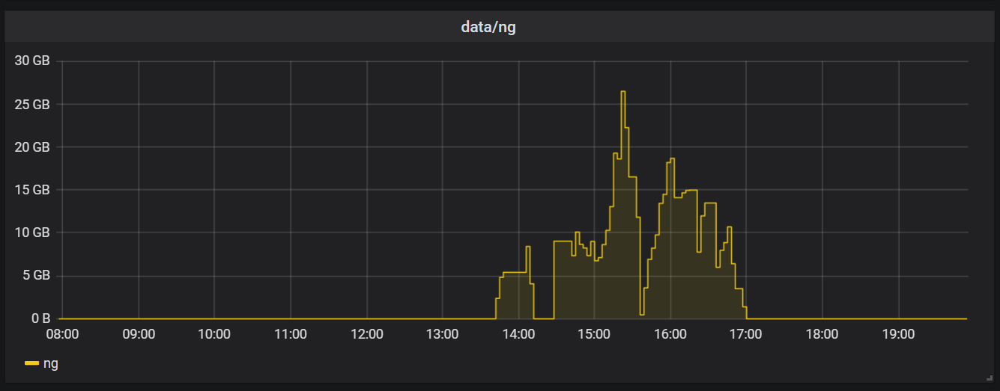
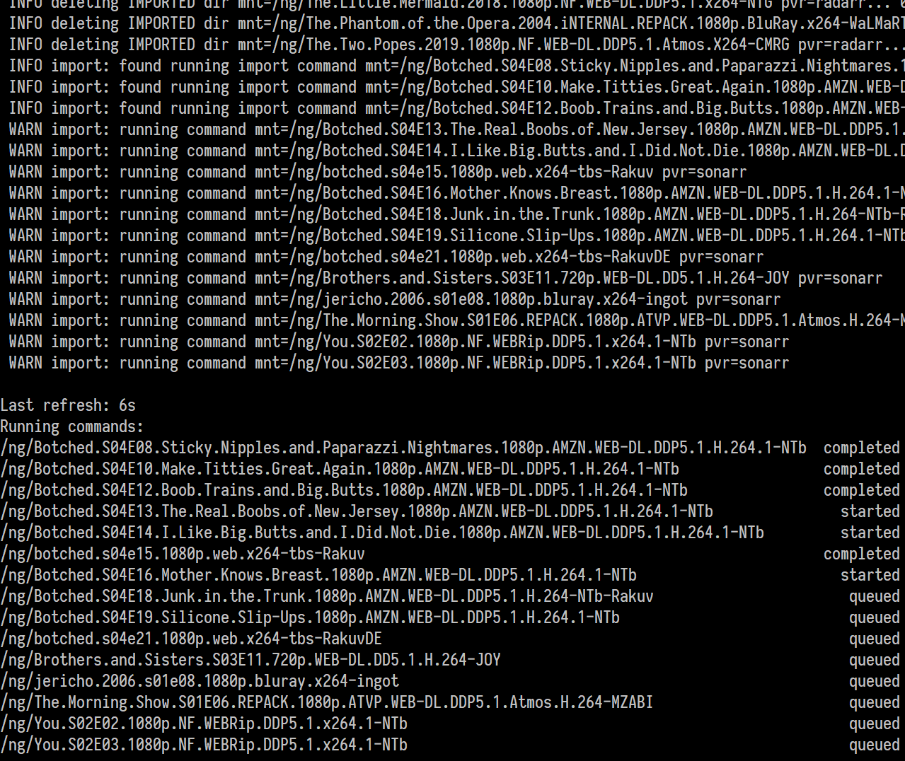

# sabprune

> SABnzbd auto-cleanup after misfired imports by Radarr/Sonarr

Often times, Radarr and Sonarr fail to properly import files downloaded by
SABnzbd. They either do a copy and leave source files behind, don't necessarily
mark the files as imported, or don't even seem to trigger any import task at
all.

This program compensates for such mishaps. Directories are matched against each
PVR's grab and import history. Necessary imports are triggered and waited for
until completion. Files left are double checked afterwards.

Also:

* cleans up leftovers in incomplete dir after finished downloads
* cleans up empty \_UNPACK_ dirs
* cleans up junk dirs containing only raw ng article files

## Screenshots

Disk usage from SABnzbd returning to zero:

Triggered import commands:

## Related

* [qbtprune](https://github.com/Roman2K/qbtprune)
* [alerterr](https://github.com/Roman2K/alerterr)
