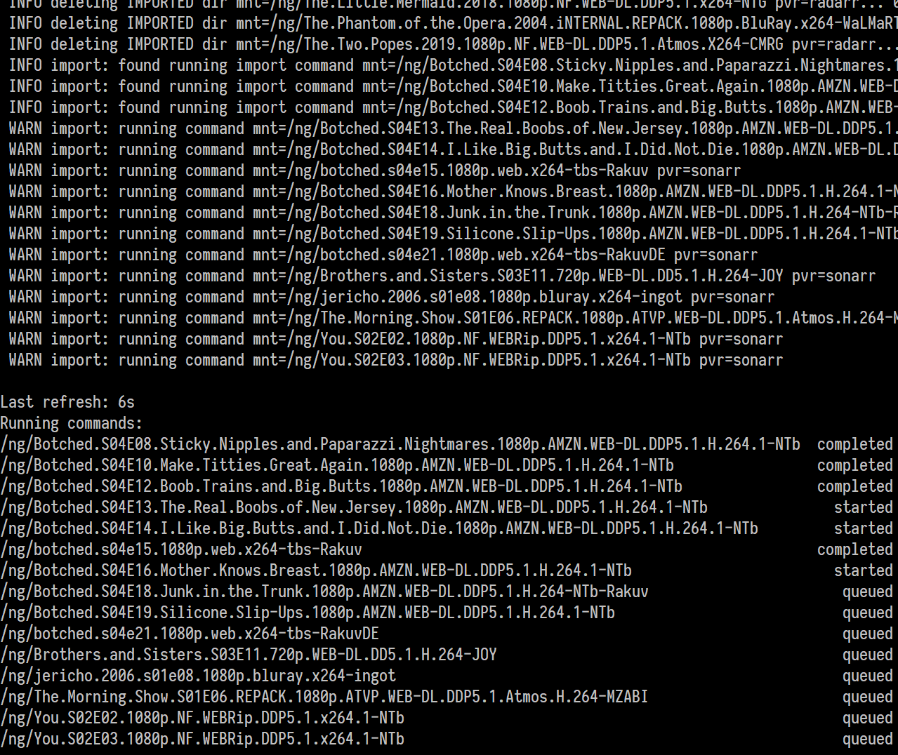

# sabprune

> SABnzbd auto-cleanup after misfired imports by Radarr/Sonarr

Often times, Radarr and Sonarr fail to properly import files downloaded by
SABnzbd. They either do a copy and leave source files behind, don't necessarily
mark the files as imported, or don't even seem to trigger any import task at
all.

This program compensates for such mishaps. Also deletes empty \_UNPACK_ dirs and
those left with only raw ng article files.

Directories are matched against each PVR's grab and import history. Necessary
imports are triggered by running the command in the corresponding PVR and waited
for until completion. Files left are double checked afterwards.

Example output:

## Related

* [qbtprune](https://github.com/Roman2K/qbtprune)
* [alerterr](https://github.com/Roman2K/alerterr)
